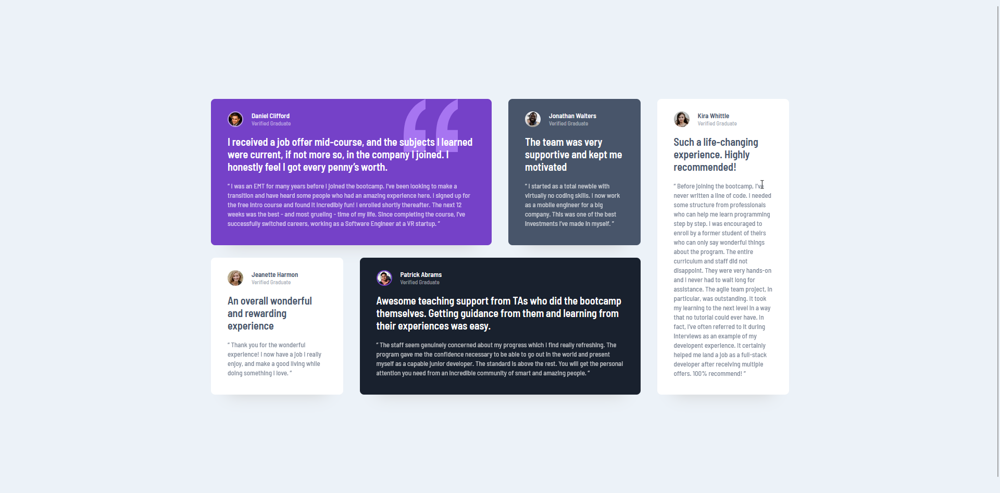

# Frontend Mentor - Testimonials grid section solution

This is a solution to the [Testimonials grid section challenge on Frontend Mentor](https://www.frontendmentor.io/challenges/testimonials-grid-section-Nnw6J7Un7).

## Table of contents

- [Overview](#overview)
  - [The challenge](#the-challenge)
  - [Screenshot](#screenshot)
  - [Links](#links)
- [My process](#my-process)
  - [Built with](#built-with)
  - [What I learned](#what-i-learned)
  - [Continued development](#continued-development)
  - [Useful resources](#useful-resources)
- [Author](#author)

## Overview

### The challenge

Users should be able to:

- View the optimal layout for the site depending on their device's screen size

### Screenshot

### Links

- Solution URL: [https://github.com/whatTheFath/testimonial-grid-section-frontend-mentor](https://github.com/whatTheFath/testimonial-grid-section-frontend-mentor)
- Live Site URL: [https://whatthefath.github.io/testimonial-grid-section-frontend-mentor/](https://whatthefath.github.io/testimonial-grid-section-frontend-mentor/)

## My process

### Built with

- Semantic HTML5 markup
- CSS custom properties
- Flexbox
- CSS Grid
- SASS
- BEM

### What I learned

I learned how to use BEM Methodology while using SASS

### Useful resources

- [The Net Ninja CSS Grid Tuts](https://www.youtube.com/playlist?list=PL4cUxeGkcC9itC4TxYMzFCfveyutyPOCY)

## Author

- Frontend Mentor - [@whatTheFath](https://www.frontendmentor.io/profile/whatTheFath)
- Twitter - [@FathulIrfaan](https://www.twitter.com/FathulIrfaan)
